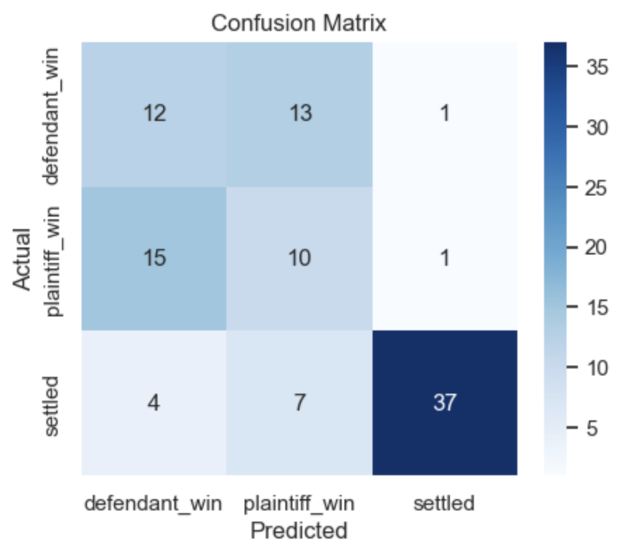
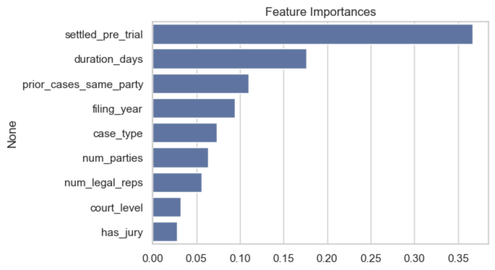

# Case Outcome Prediction Analysis

A machine learning project that predicts the outcome of cases based on input features using data-driven models.

---

## Project Overview

This project focuses on building predictive models to determine case outcomes (e.g., success/failure, approval/rejection) using structured data. It demonstrates the end-to-end machine learning pipeline, including data preprocessing, feature engineering, model training, and evaluation.

Predictive modeling is widely used across domains (legal, healthcare, finance) to estimate outcomes from historical data and patterns.

---

## Features

- Data preprocessing and cleaning
- Feature selection / engineering
- Model training using machine learning algorithms
- Model evaluation and performance metrics
- Visualization of results (if included)

---

## Workflow

1. Load dataset
2. Clean and preprocess data
3. Perform feature engineering
4. Split into training and testing sets
5. Train machine learning model(s)
6. Evaluate performance using metrics (accuracy, precision, recall, etc.)

---

## Installation

Clone the repository:

```
git clone https://github.com/shelly-gsr/case-outcome-prediction.git
cd case-outcome-prediction
```

--- 

## Example Output

- Model performance is evaluated using standard classification metrics
- Results may vary depending on dataset and model choice




---

## Possible Improvements

- Hyperparameter tuning
- Use advanced models (XGBoost, Neural Networks)
- Deploy as a web app (Streamlit / Flask)
- Add more dataset features